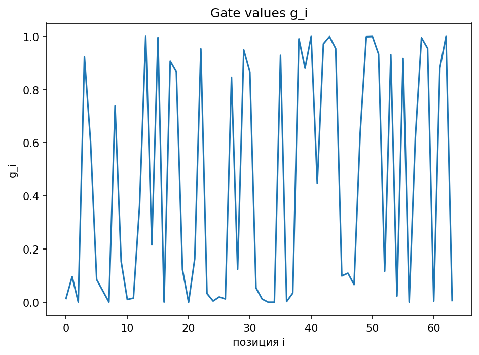
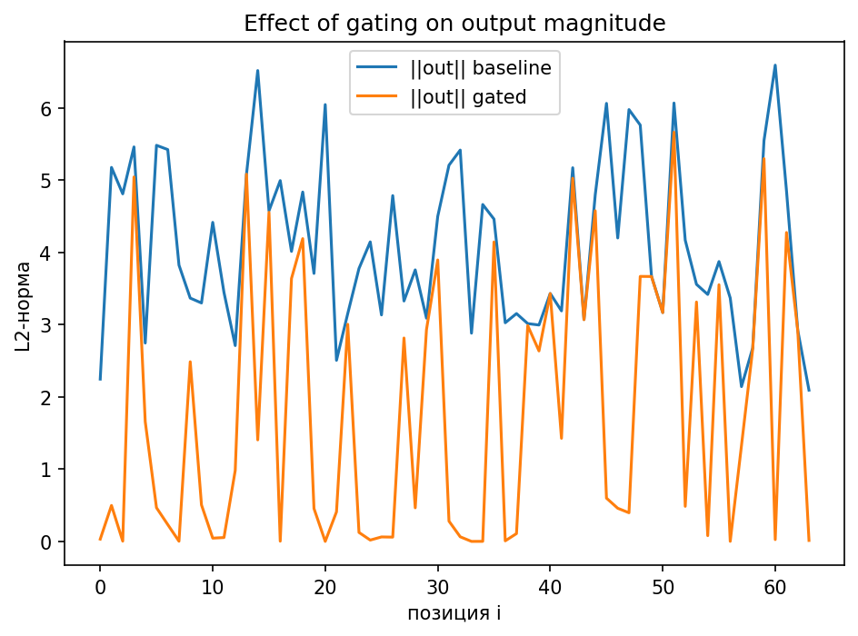
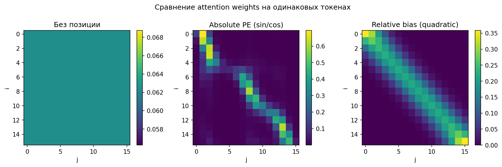
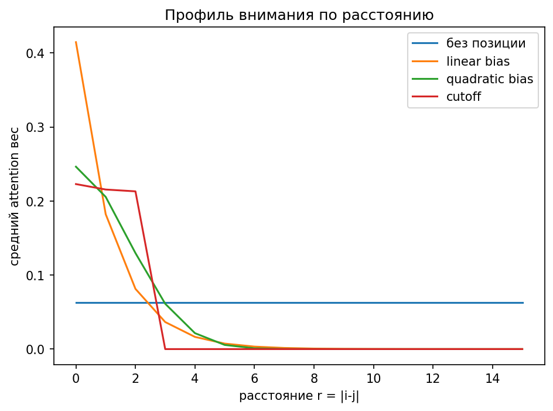

# NLP Paper Notes & Toy Experiments

Небольшой исследовательский репозиторий с конспектами статей по NLP / LLM
и воспроизведением ключевых идей в виде простых toy-экспериментов.

Цель репозитория — разобраться в **индуктивных байасах** современных архитектур
(в первую очередь self-attention) и проследить, как архитектурные и
preprocessing-решения влияют на поведение модели.

Репозиторий не претендует на SOTA-результаты и ориентирован на
качественное понимание механизмов.

---

## 📄 Paper notes

В папке `papers/` собраны краткие конспекты и заметки по ключевым идеям.

- `papers/icml_transformer_attention.md`  
  Разбор self-attention и scaled dot-product attention
  (по мотивам Transformer-архитектур, ICML / NeurIPS).

- `papers/icml_llm_scaling_laws.md`  
  Краткий обзор scaling laws для больших языковых моделей.

- `papers/attention_mechanisms_comparison.md`  
  Сравнение различных механизмов внимания
  (dot-product, scaled, additive и др.).

- `papers/positional_encoding_bias.md`  
  Заметки о positional encoding и relative bias как источнике
  индуктивных байасов.

---

## 🧪 Toy experiments

Эксперименты реализованы в максимально простой форме
(NumPy / Matplotlib), без внешних фреймворков.

### Gated Attention (toy study)

Ноутбук: `notebooks/gated_attention_toy.ipynb`

Идея: разделить роли
- *куда смотреть* (attention),
- *сколько информации пропускать* (gate).

В эксперименте показано, как скалярный gate влияет на амплитуду выхода
attention при фиксированной карте внимания.

<p align="center">
  
</p>

<p align="center">
  
</p>

---

### Positional Encoding as Inductive Bias (toy study)

Ноутбук: `notebooks/positional_encoding_and_inductive_bias.ipynb`

Цель эксперимента — показать, что self-attention без позиционной информации
инвариантен к перестановкам и не содержит геометрии последовательности.

Сравниваются:
- attention без positional encoding,
- absolute positional encoding,
- relative positional bias.

Показано, как зависимость от расстояния `|i - j|` влияет на локальность
и структуру внимания.

<p align="center">
  
</p>

<p align="center">
  
</p>

---

### Tokenization & preprocessing (toy study)

Ноутбук: `notebooks/tokenization_and_preprocessing_toy.ipynb`

Исследуется влияние выбора токенизации и предобработки на:
- длину последовательности,
- вычислительную стоимость self-attention (`O(n^2)`),
- распределение токенов.

Сравниваются:
- word-level токенизация,
- char-level токенизация,
- упрощённый toy-BPE,
- toy-stemming и toy-lemmatization.

---

## 🔬 Research-style summary

На основе toy-экспериментов сформулирована следующая интуиция:

Relative positional bias в self-attention можно интерпретировать
как дискретный аналог потенциального взаимодействия,
зависящего от расстояния между элементами последовательности.

Введена простая количественная метрика — *энергия внимания* —
и показано, что форма positional bias напрямую влияет на
локальность и «энергетический режим» attention.

Подход мотивирован аналогиями с физическими моделями
взаимодействующих частиц и служит инструментом
для качественного анализа архитектурных решений в NLP.

---

## 🛠 How to run

```bash
python3 -m venv .venv
source .venv/bin/activate
pip install -r requirements.txt

Ноутбуки можно запускать напрямую через Jupyter:

jupyter notebook