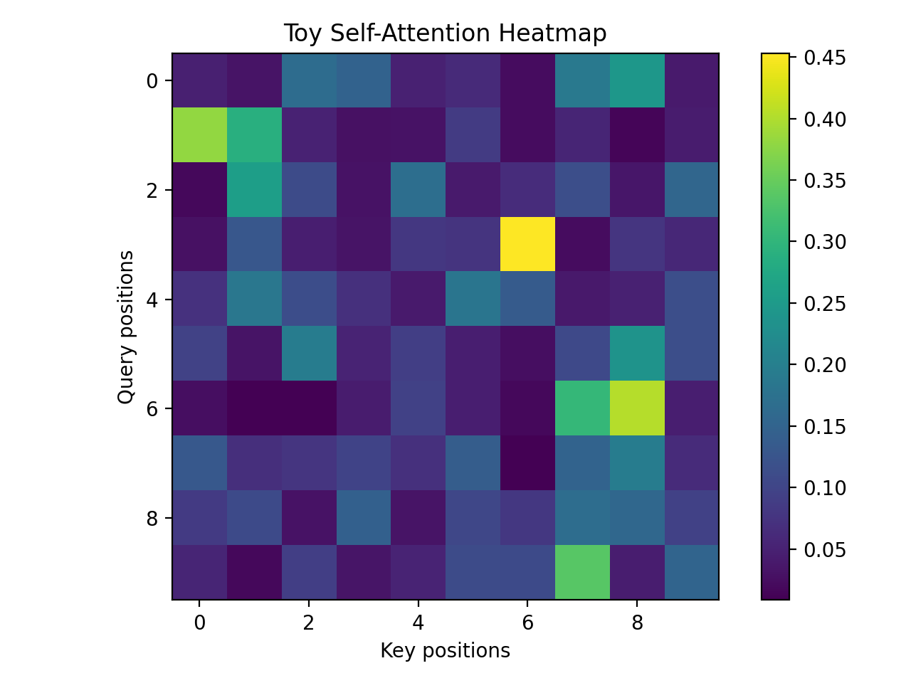

# NLP Paper Notes & Toy Experiments

Небольшой исследовательский репозиторий с конспектами статей по NLP / LLM
и воспроизведением ключевых идей в виде простых экспериментов.

## 📄 Papers

- `papers/icml_transformer_attention.md`  
  Краткий разбор self-attention и scaled dot-product attention
  (по мотивам Transformer-архитектур, ICML / NeurIPS).

## 🧪 Experiments

- `experiments/toy_attention_experiment.py`  
  Минимальная реализация self-attention (NumPy) и визуализация
  attention-матрицы.

Пример результата:

<p align="center">
  
</p>

## 🛠 How to run

```bash
python3 -m venv .venv
source .venv/bin/activate
pip install -r requirements.txt
python3 experiments/toy_attention_experiment.py
